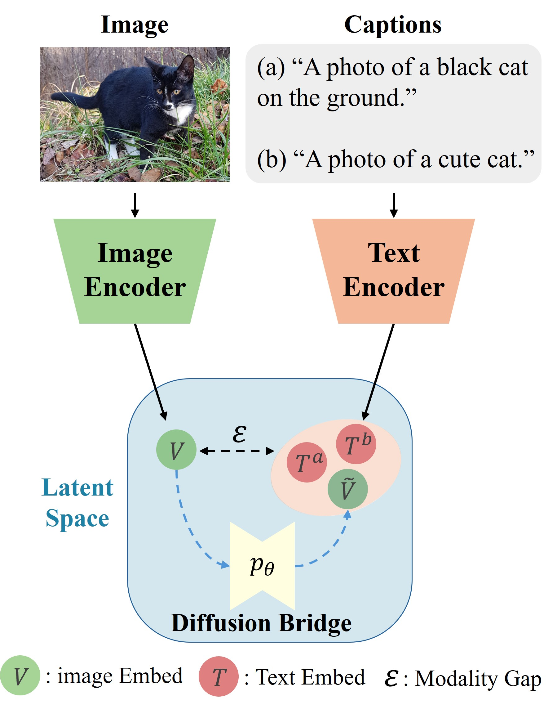

# Diffusion Bridge: Leveraging Diffusion Model to Reduce the Modality Gap Between Text and Vision for Zero-Shot Image Captioning

This repo provides the PyTorch source code of our paper: 
[Diffusion Bridge: Leveraging Diffusion Model to Reduce the Modality Gap Between Text and Vision for Zero-Shot Image Captioning](https://openaccess.thecvf.com/content/CVPR2025/html/Lee_Diffusion_Bridge_Leveraging_Diffusion_Model_to_Reduce_the_Modality_Gap_CVPR_2025_paper.html) (CVPR 2025).

## 🔮 Abstract

The modality gap between vision and text embeddings in CLIP presents a significant challenge for zero-shot image captioning, limiting effective cross-modal representation. Traditional approaches, such as noise injection and memory-based similarity matching, attempt to address this gap, yet these methods either rely on indirect alignment or relatively naive solutions with heavy computation. Diffusion Bridge introduces a novel approach to directly reduce this modality gap by leveraging Denoising Diffusion Probabilistic Models (DDPM), trained exclusively on text embeddings to model their distribution. Our approach is motivated by the observation that, while paired vision and text embeddings are relatively close, a modality gap still exists due to stable regions created by the contrastive loss. This gap can be interpreted as noise in cross-modal mappings, which we approximate as Gaussian noise. To bridge this gap, we employ a reverse diffusion process, where image embeddings are strategically introduced at an intermediate step in the reverse process, allowing them to be refined progressively toward the text embedding distribution. This process transforms vision embeddings into text-like representations closely aligned with paired text embeddings, effectively minimizing discrepancies between modalities. Experimental results demonstrate that these text-like vision embeddings significantly enhance alignment with their paired text embeddings, leading to improved zero-shot captioning performance on MSCOCO and Flickr30K. Diffusion Bridge achieves competitive results without reliance on memory banks or entity-driven methods, offering a novel pathway for cross-modal alignment and opening new possibilities for the application of diffusion models in multi-modal tasks.

## 💡 Approach
 

**Figure: Overview of the motivation behind our approach, $C^3$.** Our work provides a theoretical explanation of the unique geometry that arises from multi-modal contrastive learning, where a modality gap and alignment noise exist in the learned representation space. Building upon this observation, we present a straightforward technique, $C^3$, which enhances the interchangeability of embeddings between modalities, enabling the creation of cross-modal applications using only uni-modal data.

## 🚀 Getting Started

- Reproduce diffusion model [here](ddpm/README.md).

- Reproduce image captioning results [here](image_captioning/README.md).

## Acknowledgements
We sincerely thank [lucidrains](https://github.com/lucidrains) and [Yuhui Zhang](https://scholar.google.co.kr/citations?user=X-Agfu8AAAAJ&hl=ko&oi=sra). We borrow codes heavly from their repositories [denoising-diffusion-pytorch](https://github.com/lucidrains/denoising-diffusion-pytorch) and [C3](https://github.com/yuhui-zh15/C3). Without them, we could not finish this work.

